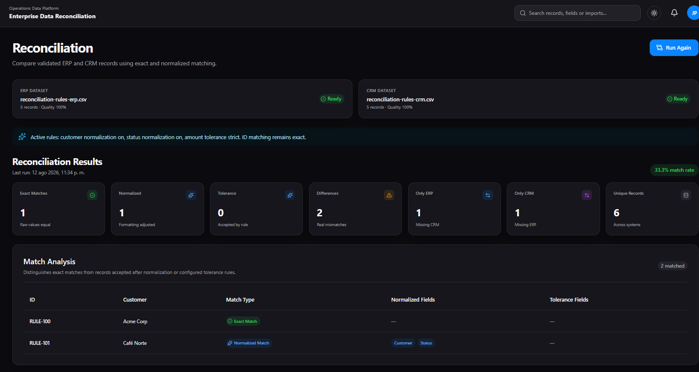
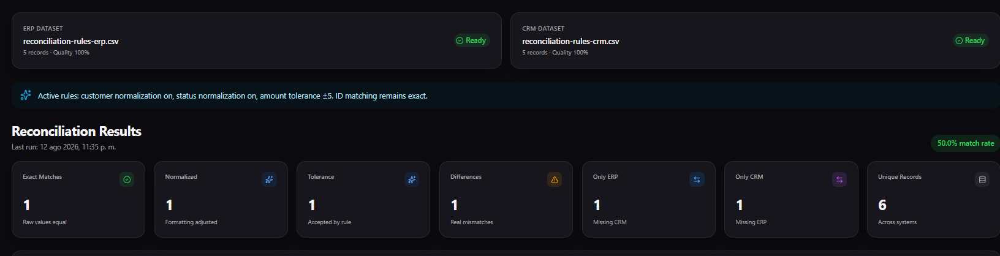
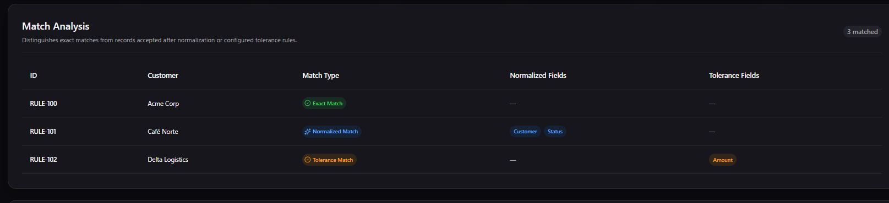
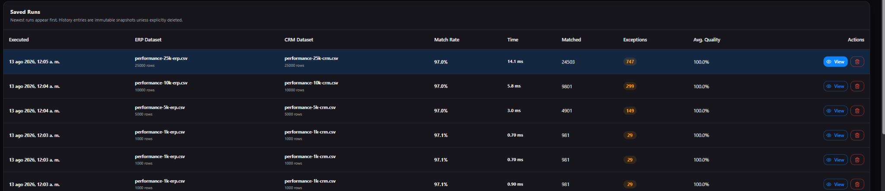
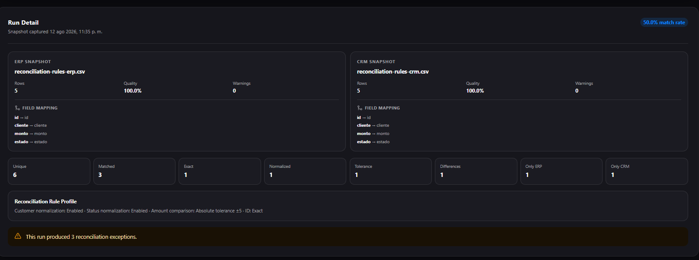
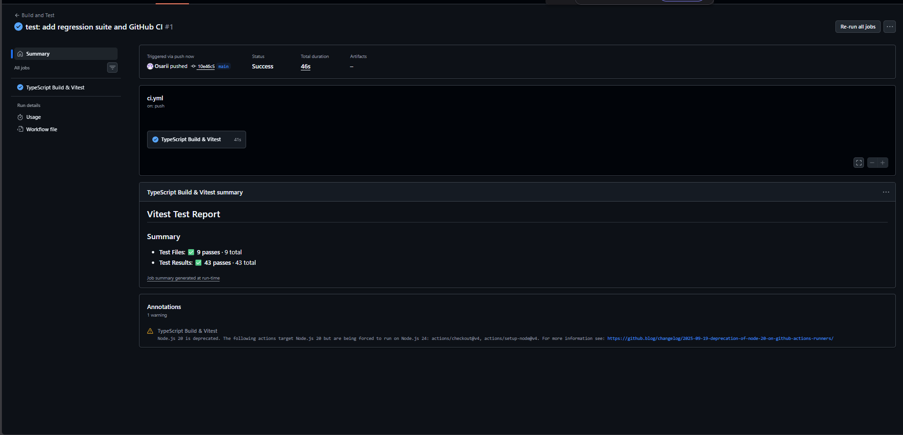
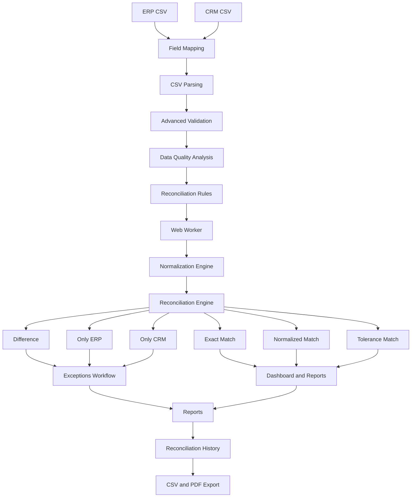

# Enterprise Data Reconciliation Platform

[](https://github.com/Osarii/enterprise-data-reconciliation/actions/workflows/ci.yml)


A modern enterprise-oriented data reconciliation platform designed to compare ERP and CRM datasets, detect inconsistencies, evaluate data quality, manage exceptions, analyze reconciliation performance, and generate executive reports.

The project focuses on solving a common enterprise problem:

> **How can organizations reliably detect discrepancies between business systems that are expected to contain equivalent information?**

---

## Overview

Enterprise systems frequently store overlapping information across platforms such as:

* ERP systems
* CRM platforms
* Financial systems
* Billing platforms
* Customer databases
* Operational systems

Over time, these systems may become inconsistent because of:

* Manual data entry
* Synchronization failures
* Duplicate records
* Inconsistent formatting
* Invalid values
* Missing records
* Integration errors
* Schema differences between systems
* Different business rules between platforms

**Enterprise Data Reconciliation Platform** provides a workflow for importing two datasets, validating their quality, mapping source fields, normalizing comparable information, applying reconciliation rules, reconciling records, reviewing exceptions, analyzing historical performance, and generating reports.

---

# Current Version

## v0.1.10 — Frontend Release Candidate

The current development version includes:

* ERP and CRM CSV imports
* Configurable field mapping
* Automatic field mapping suggestions
* CSV parsing with PapaParse
* Schema validation with Zod
* Advanced data quality validation
* Duplicate ID detection
* Configurable status validation
* Suspicious ID detection
* Structured validation issues
* Blocking and warning severities
* Data Quality Score V2
* Normalization engine
* Configurable reconciliation rules
* Absolute amount tolerance
* Exact Match detection
* Normalized Match detection
* Tolerance Match detection
* Difference detection
* ERP-only records
* CRM-only records
* Exception management
* Executive dashboard
* Reconciliation reports
* Reconciliation history
* Historical metrics
* Historical charts
* Processing performance metrics
* Web Worker reconciliation
* Large Dataset Mode
* CSV export
* PDF export
* Dark mode
* Browser persistence
* Lazy-loaded routes
* Responsive navigation
* Mobile and tablet Drawer
* Quick Navigation search
* Workspace alerts
* Error Boundary
* Not Found page
* Accessibility improvements
* Automated tests with Vitest
* GitHub Actions CI

The application currently operates primarily on the frontend.

A backend architecture using **NestJS, PostgreSQL, and Prisma** is planned for the next major development phase.

---

# Screenshots

The following screenshots show the platform working with real reconciliation scenarios developed during the V0.1 frontend cycle.

## Reconciliation — Strict Rules

<p align="center">
  
</p>

The strict rule profile keeps amount tolerance disabled. In the demonstrated scenario, the platform identifies Exact and Normalized matches while preserving meaningful amount differences as reconciliation exceptions.

---

## Reconciliation — Amount Tolerance ±5

<p align="center">
  
</p>

After enabling an absolute tolerance of `±5`, a previously different amount can be accepted as a **Tolerance Match**, increasing the Match Rate without hiding larger discrepancies.

---

## Match Analysis

<p align="center">
  
</p>

Match Analysis explains why a record was accepted and distinguishes between:

* Exact Match
* Normalized Match
* Tolerance Match

It also identifies which fields required normalization or tolerance.

---

## Reconciliation History — Saved Runs

<p align="center">
  
</p>

History keeps compact immutable snapshots with dataset metadata, Match Rate, processing time, matched records, exceptions and Data Quality metrics.

---

## Reconciliation History — Run Detail

<p align="center">
  
</p>

Historical Run Detail preserves:

* ERP and CRM snapshots
* Field Mapping
* Data Quality
* Exact / Normalized / Tolerance results
* Differences
* Reconciliation Rule Profile
* Exception totals

---

## GitHub Actions — Build & Test

<p align="center">
  
</p>

The repository uses GitHub Actions to validate the regression suite and production build automatically.

Current frontend regression suite:

```text
Test Files  10 passed
Tests       47 passed
```

---

# Key Features

## CSV Import

ERP and CRM datasets can be independently imported using CSV files.

The import pipeline includes:

* CSV parsing
* Header inspection
* Configurable field mapping
* Structural validation
* Required field validation
* Duplicate detection
* Value validation
* Status validation
* Suspicious identifier detection
* Data quality analysis
* Processing metrics

---

# Configurable Field Mapping

Enterprise systems rarely use identical schemas.

An ERP system may contain:

```text
customer_id
customer_name
balance
status
```

while a CRM system may contain:

```text
account_code
display_name
amount_due
lifecycle_status
```

The platform maps both source schemas to a shared canonical model:

```text
id
cliente
monto
estado
```

Example ERP mapping:

```text
customer_id     → id
customer_name   → cliente
balance         → monto
status          → estado
```

Example CRM mapping:

```text
account_code       → id
display_name       → cliente
amount_due         → monto
lifecycle_status   → estado
```

This allows the reconciliation engine to remain independent from source-specific column names.

---

# Reconciliation Architecture



---

# Canonical Data Model

The current reconciliation model uses four canonical fields:

| Field     | Description                |
| --------- | -------------------------- |
| `id`      | Unique business identifier |
| `cliente` | Customer or entity name    |
| `monto`   | Monetary value             |
| `estado`  | Business status            |

Future versions are planned to support more advanced configurable schemas and reconciliation rules.

---

# Advanced Validation

The validation engine produces structured data quality issues.

Each issue can contain information such as:

```ts
type
severity
message
row
field
value
relatedRows
```

This allows the platform to analyze validation problems programmatically instead of relying only on plain error strings.

---

## Data Quality Issue Categories

Current categories include:

* Missing Value
* Invalid Amount
* Negative Amount
* Duplicate ID
* Invalid Status
* Suspicious ID
* Unexpected Column
* Missing Column
* CSV Parse Error
* Empty File

---

# Severity System

Validation issues are classified into two severity levels.

## BLOCKING

Blocking issues prevent reconciliation from running.

Examples:

* Duplicate IDs
* Missing required values
* Invalid amounts
* Negative amounts
* Missing required columns
* Invalid status values
* CSV parsing failures
* Empty datasets

## WARNING

Warnings indicate suspicious or potentially problematic information but do not prevent reconciliation.

Examples:

* Suspicious IDs
* Unexpected columns

This approach avoids rejecting potentially valid enterprise information unnecessarily.

---

# Duplicate Detection

Duplicate identifiers are treated as blocking issues because the reconciliation process expects each ID to uniquely identify a record.

The platform reports:

* The duplicated identifier
* The number of duplicate occurrences
* The exact rows where the duplicate appears

Example:

```text
Duplicate ID: DUP-001

Rows:
3, 4
```

---

# Suspicious ID Detection

Enterprise identifiers are not assumed to contain only numbers.

Valid identifiers may include formats such as:

```text
CUS-10025
CR-2026-001
ACC_0054
```

The validation engine can flag suspicious patterns including:

* Unusually short identifiers
* Extremely long identifiers
* Leading or trailing spaces
* Internal spaces
* Unusual characters
* Repeated separators
* Separators at the beginning or end

Suspicious identifiers generate warnings rather than blocking errors.

---

# Status Validation

Business statuses are validated against an application-defined catalog.

Current default values include:

```text
Activo
Inactivo
Pendiente
```

Status validation uses normalization.

Therefore:

```text
Activo
activo
ACTIVO
 Activo
```

are recognized as equivalent valid values.

Values such as:

```text
Actiov
Cancelado
Desconocido
```

are reported as invalid statuses.

The configuration is designed so status catalogs can become customizable in future versions.

---

# Data Quality Score V2

The platform includes an **application-defined Data Quality Score**.

It is not presented as an international standard.

The objective is to provide a simple, explainable, and defendable quality metric that can be understood by both technical and business stakeholders.

The score begins at:

```text
100
```

and applies weighted penalties based on factors such as:

* Rows containing blocking issues
* Rows containing warnings
* Duplicate identifiers
* Structural validation problems

Conceptually:

```text
Score = 100
        - Blocking Impact
        - Warning Impact
        - Duplicate Impact
        - Structural Impact
```

Blocking problems have significantly more impact than warnings.

The final score is constrained between:

```text
0 – 100
```

---

## Data Quality Metrics

Each imported dataset includes metrics such as:

* Data Quality Score
* Blocking Issues
* Warnings
* Duplicate IDs
* Invalid Values
* Total Rows
* Clean Rows
* Rows With Issues

The platform also displays an Issue Breakdown.

Example:

```text
Duplicate ID        1
Invalid Amount      2
Suspicious ID       3
Unexpected Column   2
```

---

# Normalization Engine

Before comparing textual information, selected values are normalized.

Current normalization includes:

* Trimming whitespace
* Collapsing repeated spaces
* Lowercase conversion
* Removing diacritics

For example:

```text
Medical Solutions CR
 medical solutions cr
MEDICAL SOLUTIONS CR
```

are considered equivalent after normalization.

Likewise:

```text
Café Central
CAFE CENTRAL
```

can produce a normalized match.

---

# Configurable Reconciliation Rules

The reconciliation engine supports configurable comparison rules.

Current options include:

* Customer normalization
* Status normalization
* Amount tolerance
* Exact ID matching

ID matching intentionally remains exact.

---

# Monetary Comparison

Monetary values can use strict comparison or an absolute tolerance rule.

Strict example:

```text
120000
120001
```

produces:

```text
Difference
```

With a configured tolerance of `±5`:

```text
ERP amount: 5000
CRM amount: 5003
```

can produce:

```text
Tolerance Match
```

while:

```text
ERP amount: 10000
CRM amount: 10020
```

still produces:

```text
Difference
```

---

# Reconciliation Results

The reconciliation engine classifies records into six main outcomes.

## Exact Match

All relevant values match exactly.

```text
ERP = CRM
```

---

## Normalized Match

Values are not textually identical but become equivalent after normalization.

Example:

```text
ERP: Café Central
CRM: CAFE CENTRAL
```

Result:

```text
Normalized Match
```

Normalized matches are considered successful reconciliations and do **not** appear as exceptions.

---

## Tolerance Match

Values differ but are accepted by a configured reconciliation rule.

Example:

```text
ERP amount: 5000
CRM amount: 5003
Tolerance: ±5
```

Result:

```text
Tolerance Match
```

Tolerance Matches are successful reconciliations and do **not** appear as exceptions.

---

## Difference

The record exists in both systems but contains meaningful discrepancies.

Example:

```text
ERP amount: 120000
CRM amount: 120100
```

Result:

```text
Difference
```

---

## Only ERP

The record exists in ERP but does not exist in CRM.

---

## Only CRM

The record exists in CRM but does not exist in ERP.

---

# Reconciliation Metrics

The platform generates business-oriented reconciliation metrics including:

* ERP Records
* CRM Records
* Unique Records
* Matched Records
* Exact Matches
* Normalized Matches
* Tolerance Matches
* Differences
* Only ERP
* Only CRM
* Exceptions
* Match Rate
* Exception Rate
* Review Completion
* Reconciliation Health

---

# Exception Management

Real reconciliation discrepancies are managed through the Exceptions workflow.

Exceptions include:

* Difference
* Only ERP
* Only CRM

The following successful matches are intentionally excluded:

* Exact Match
* Normalized Match
* Tolerance Match

Available controls include:

* Search
* Type filtering
* Pending / Reviewed filtering
* Individual review status
* Mark visible records as reviewed
* Mark visible records as pending

Review progress is shared across the application.

---

# Dashboard

The dashboard provides an executive overview of the current reconciliation.

It displays metrics such as:

* ERP record count
* CRM record count
* Total unique records
* Match rate
* Matched records
* Differences
* ERP-only records
* CRM-only records
* Exception information
* Data quality indicators

The dashboard is designed as a modern enterprise SaaS interface.

---

# Reports

The Reports module provides reconciliation analytics for operational and executive review.

Current metrics include:

* Match Rate
* Exception Rate
* Review Completion
* Unique Records
* Matched Records
* Exact Matches
* Normalized Matches
* Tolerance Matches
* Differences
* Only ERP
* Only CRM
* Exceptions
* Reconciliation Health
* ERP Data Quality
* CRM Data Quality
* Processing Performance

---

# Charts and Analytics

Visual analytics are built using **Recharts**.

Current visualizations include:

* Reconciliation distribution
* Differences by field
* Data quality indicators
* Match rate metrics
* Historical match rate trends
* Historical data quality trends
* Exceptions by reconciliation run
* Tolerance Matches by run
* Processing performance

The objective is to make reconciliation results easier to understand than raw tables alone.

---

# Reconciliation History

Every successful reconciliation can create a historical snapshot.

History captures information including:

* Execution date
* ERP dataset
* CRM dataset
* ERP Data Quality
* CRM Data Quality
* Unique Records
* Matched Records
* Exact Matches
* Normalized Matches
* Tolerance Matches
* Differences
* Only ERP
* Only CRM
* Exceptions
* Match Rate
* Processing metrics
* ERP Field Mapping
* CRM Field Mapping
* Reconciliation Rule Profile

Historical entries are intentionally compact.

The application does **not** duplicate every raw ERP and CRM record for each historical execution.

---

# History Analytics

The History module provides aggregated metrics including:

* Total Runs
* Average Match Rate
* Best Match Rate
* Average Data Quality
* Average Reconciliation Time
* Average Throughput
* Largest Run

Historical visualizations include:

* Match Rate vs Data Quality
* Exceptions vs Tolerance Matches
* Processing Performance

This makes it possible to evaluate reconciliation performance over time.

---

# Field Mapping and Rule Audit

Historical reconciliation records preserve the source-to-canonical field mapping and reconciliation rules used during each execution.

Example mapping:

```text
ERP

customer_id     → id
customer_name   → cliente
balance         → monto
status          → estado
```

Example rule profile:

```text
Customer normalization: Enabled
Status normalization: Enabled
Amount comparison: Absolute tolerance ±5
ID matching: Exact
```

This provides useful integration context when reviewing previous reconciliations.

---

# PDF Reporting

The application provides PDF exports using:

* jsPDF
* jsPDF-AutoTable
* html2canvas

PDF reports are designed to contain:

* Executive metrics
* Data quality metrics
* Reconciliation results
* Charts
* Exceptions
* Historical performance
* Processing metrics
* Field mapping audit information
* Reconciliation rule audit
* Report generation date
* Page numbering
* Report metadata

Heavy reporting dependencies are loaded only when required.

---

# CSV Export

Reconciliation information can also be exported as CSV for additional analysis using external tools.

---

# Processing Performance

The platform measures browser-observed processing metrics such as:

* CSV Parse Time
* Validation Time
* Import Processing Time
* Reconciliation Time
* Rows Processed
* Throughput
* Workload Tier

These metrics are application instrumentation and are not presented as scientific benchmarks.

---

# Workload Classification

Current application-defined workload tiers are:

```text
Small   ≤ 5,000 rows
Medium  5,001 – 20,000 rows
Large   > 20,000 rows
```

These classifications are used for UI guidance and processing decisions.

---

# Web Worker Reconciliation

Large reconciliation jobs are processed outside the browser main thread.

```text
React UI
   │
   │ postMessage
   ▼
Web Worker
   │
   ├── Normalization
   ├── Matching
   ├── Reconciliation Rules
   └── Processing Metrics
   │
   ▼
React UI
```

The application has been manually tested with:

```text
1,000 records
5,000 records
10,000 records
25,000 ERP + 25,000 CRM records
```

The 25k + 25k scenario was used to detect and resolve main-thread blocking.

---

# Large Dataset Mode

Browser storage is intentionally not treated as unlimited enterprise storage.

Large datasets can remain in memory while compact information continues to be persisted.

Large Dataset Mode preserves information such as:

* Reconciliation history
* Processing metrics
* Field mappings
* Reconciliation rules
* Application settings

while avoiding the storage of very large active raw datasets in `localStorage`.

---

# Dark Mode

The application includes both light and dark appearance modes.

The selected theme is persisted between sessions.

The interface follows a modern enterprise SaaS visual style using:

* Material UI
* Neutral backgrounds
* White or dark elevated surfaces
* Blue accent colors
* Responsive layouts

---

# Persistence

The current frontend uses browser storage to preserve application state for appropriate workspace sizes.

Persisted information can include:

* ERP dataset
* CRM dataset
* Validation results
* Data Quality metrics
* Reconciliation results
* Exception review status
* Reconciliation history
* Field mapping profiles
* Reconciliation rules
* Appearance preference

The current development implementation uses:

```text
localStorage
```

Large datasets can operate in memory-only mode when full persistence would exceed browser storage limits.

This is intentionally a **frontend development persistence layer** and is not intended to represent the final enterprise storage architecture.

---

# Responsive Design

The application includes responsive desktop, tablet, and mobile navigation.

Desktop uses a persistent sidebar.

Smaller screens use a Material UI Drawer accessible from the Header.

---

# Quick Navigation

The Header search also works as a navigation tool.

Examples:

```text
pdf       → Reports
tolerance → Reconciliation
storage   → Settings
history   → History
```

---

# Workspace Alerts

The Header notification control can surface contextual workspace alerts such as:

* Blocking Data Quality issues
* Reconciliation exceptions
* Large Dataset Mode
* Persistence problems

---

# Accessibility and Error Handling

The frontend includes:

* Skip to main content
* Keyboard navigation support
* Focus-visible states
* Route announcements
* Reduced-motion support
* Global Error Boundary
* Route-aware document titles
* Dedicated Not Found page

---

# Automated Testing

The project uses **Vitest** for automated regression testing.

Current confirmed local result:

```text
Test Files  10 passed (10)
Tests       47 passed (47)
```

Tests cover areas including:

* Normalization
* Data Quality
* Field Mapping
* Reconciliation Rules
* Schema validation
* Reconciliation Engine
* Processing metrics
* Reconciliation History
* Persistence
* Navigation configuration

---

# GitHub Actions CI

The repository includes an automated GitHub Actions workflow.

```text
.github/workflows/ci.yml
```

The CI pipeline performs:

```text
Checkout
   ↓
Setup Node.js
   ↓
npm ci
   ↓
npm run test:run
   ↓
npm run build
   ↓
Success / Failure
```

The objective is to prevent regressions from being merged without automated validation.

---

# Planned Backend Architecture

A future backend version will replace frontend-only persistence with:

```text
React
   ↓
REST API
   ↓
NestJS
   ↓
Prisma ORM
   ↓
PostgreSQL
```

Potential backend entities include:

```text
User
Organization
Dataset
Import
ImportRow
DataQualityIssue
FieldMapping
ReconciliationRule
Reconciliation
ReconciliationResult
Exception
ExceptionReview
Report
AuditLog
```

---

# Technology Stack

## Frontend

* React
* TypeScript
* Vite
* Material UI
* React Router

## Data Processing

* PapaParse
* Zod

## Data Visualization

* Recharts

## Reporting

* jsPDF
* jsPDF-AutoTable
* html2canvas

## Performance

* Web Workers
* Lazy loading
* Dynamic imports
* Processing instrumentation

## Testing

* Vitest
* jsdom
* V8 Coverage

## CI

* GitHub Actions

## Icons

* Lucide React

## Persistence

* localStorage
* Memory-only Large Dataset Mode

## Version Control

* Git
* GitHub

---

# Project Explorer

GitHub supports collapsible sections, so the main project areas can be explored directly from this README.

<details>
<summary><strong>📁 src — Application source</strong></summary>

<br>

<details>
<summary>📁 components</summary>

* [`src/components/common/`](src/components/common/)
  * [`AppErrorBoundary.tsx`](src/components/common/AppErrorBoundary.tsx) — global React error fallback
  * [`PageLoader.tsx`](src/components/common/PageLoader.tsx) — lazy-route loading state
  * [`RouteAnnouncer.tsx`](src/components/common/RouteAnnouncer.tsx) — accessible route announcements
* [`src/components/layout/`](src/components/layout/)
  * [`Header.tsx`](src/components/layout/Header.tsx) — search, theme, alerts and mobile navigation
  * [`Sidebar.tsx`](src/components/layout/Sidebar.tsx) — main workspace navigation

</details>

<details>
<summary>📁 config</summary>

* [`dataQualityConfig.ts`](src/config/dataQualityConfig.ts)
* [`fieldMappingConfig.ts`](src/config/fieldMappingConfig.ts)
* [`navigationConfig.ts`](src/config/navigationConfig.ts)
* [`performanceConfig.ts`](src/config/performanceConfig.ts)
* [`reconciliationRulesConfig.ts`](src/config/reconciliationRulesConfig.ts)
* [`storageConfig.ts`](src/config/storageConfig.ts)

</details>

<details>
<summary>📁 context</summary>

* [`ReconciliationContext.tsx`](src/context/ReconciliationContext.tsx) — shared reconciliation workspace state
* [`ThemeModeContext.tsx`](src/context/ThemeModeContext.tsx) — light/dark appearance state

</details>

<details>
<summary>📁 pages</summary>

* [`Dashboard/`](src/pages/Dashboard/)
* [`Imports/`](src/pages/Imports/)
* [`Reconciliation/`](src/pages/Reconciliation/)
* [`Exceptions/`](src/pages/Exceptions/)
* [`Reports/`](src/pages/Reports/)
* [`History/`](src/pages/History/)
* [`Settings/`](src/pages/Settings/)
* [`NotFound/`](src/pages/NotFound/)

</details>

<details>
<summary>📁 schemas</summary>

* [`reconciliationSchema.ts`](src/schemas/reconciliationSchema.ts)

</details>

<details>
<summary>📁 types</summary>

The TypeScript domain model lives in [`src/types/`](src/types/) and includes interfaces for:

* CSV validation
* imported datasets
* field mappings
* reconciliation rules
* reconciliation records/results
* history snapshots
* processing metrics

</details>

<details>
<summary>📁 utils</summary>

Business logic is isolated under [`src/utils/`](src/utils/), including:

* normalization
* CSV parsing
* Data Quality calculation
* field mapping
* reconciliation
* history generation
* performance metrics
* workspace persistence
* Web Worker client communication

</details>

<details>
<summary>📁 workers</summary>

* [`reconciliation.worker.ts`](src/workers/reconciliation.worker.ts) — non-blocking reconciliation processing

</details>

<br>

Main application files:

* [`App.tsx`](src/App.tsx)
* [`main.tsx`](src/main.tsx)
* [`index.css`](src/index.css)
* [`theme.ts`](src/theme.ts)

</details>

<details>
<summary><strong>🧪 tests — Automated regression suite</strong></summary>

<br>

* [`normalizeData.test.ts`](tests/normalizeData.test.ts)
* [`dataQuality.test.ts`](tests/dataQuality.test.ts)
* [`fieldMapping.test.ts`](tests/fieldMapping.test.ts)
* [`reconciliationRules.test.ts`](tests/reconciliationRules.test.ts)
* [`reconciliationSchema.test.ts`](tests/reconciliationSchema.test.ts)
* [`reconcileData.test.ts`](tests/reconcileData.test.ts)
* [`performanceMetrics.test.ts`](tests/performanceMetrics.test.ts)
* [`reconciliationHistory.test.ts`](tests/reconciliationHistory.test.ts)
* [`workspacePersistence.test.ts`](tests/workspacePersistence.test.ts)
* [`navigationConfig.test.ts`](tests/navigationConfig.test.ts)

Current confirmed local suite:

```text
10 test files
47 tests
```

</details>

<details>
<summary><strong>📊 sample-data — Validation and performance scenarios</strong></summary>

<br>

Core scenarios:

* [`advanced-validation-good.csv`](sample-data/advanced-validation-good.csv)
* [`advanced-validation-warnings.csv`](sample-data/advanced-validation-warnings.csv)
* [`advanced-validation-errors.csv`](sample-data/advanced-validation-errors.csv)
* [`persistence-test-erp.csv`](sample-data/persistence-test-erp.csv)
* [`persistence-test-crm.csv`](sample-data/persistence-test-crm.csv)
* [`field-mapping-erp.csv`](sample-data/field-mapping-erp.csv)
* [`field-mapping-crm.csv`](sample-data/field-mapping-crm.csv)
* [`reconciliation-rules-erp.csv`](sample-data/reconciliation-rules-erp.csv)
* [`reconciliation-rules-crm.csv`](sample-data/reconciliation-rules-crm.csv)

Performance scenarios:

* [`sample-data/performance/`](sample-data/performance/)
  * 1k ERP / CRM
  * 5k ERP / CRM
  * 10k ERP / CRM
  * 25k ERP / CRM

</details>

<details>
<summary><strong>⚙️ scripts — Development utilities</strong></summary>

<br>

* [`generate-performance-data.mjs`](scripts/generate-performance-data.mjs)
* [`setup-testing.ps1`](scripts/setup-testing.ps1)
* [`run-quality-gate.ps1`](scripts/run-quality-gate.ps1)

</details>

<details>
<summary><strong>🚀 .github — Continuous Integration</strong></summary>

<br>

* [`.github/workflows/ci.yml`](.github/workflows/ci.yml) — runs tests and the production build on GitHub Actions

</details>

<details>
<summary><strong>🖼️ docs/screenshots — README visual assets</strong></summary>

<br>

* [`reconciliation-strict.png`](docs/screenshots/reconciliation-strict.png)
* [`reconciliation-tolerance.png`](docs/screenshots/reconciliation-tolerance.png)
* [`match-analysis.png`](docs/screenshots/match-analysis.png)
* [`history-saved-runs.png`](docs/screenshots/history-saved-runs.png)
* [`history-run-detail.png`](docs/screenshots/history-run-detail.png)
* [`github-actions-ci.png`](docs/screenshots/github-actions-ci.png)

</details>

---

# Project Structure

```text
src/
├── components/
│   ├── common/
│   │   ├── AppErrorBoundary.tsx
│   │   ├── PageLoader.tsx
│   │   └── RouteAnnouncer.tsx
│   └── layout/
│       ├── Header.tsx
│       └── Sidebar.tsx
│
├── config/
│   ├── dataQualityConfig.ts
│   ├── fieldMappingConfig.ts
│   ├── navigationConfig.ts
│   ├── performanceConfig.ts
│   ├── reconciliationRulesConfig.ts
│   └── storageConfig.ts
│
├── context/
│   ├── ReconciliationContext.tsx
│   └── ThemeModeContext.tsx
│
├── layouts/
│   └── MainLayout.tsx
│
├── pages/
│   ├── Dashboard/
│   ├── Imports/
│   ├── Reconciliation/
│   ├── Exceptions/
│   ├── Reports/
│   ├── History/
│   ├── Settings/
│   └── NotFound/
│
├── schemas/
│   └── reconciliationSchema.ts
│
├── types/
├── utils/
├── workers/
│   └── reconciliation.worker.ts
│
├── App.tsx
├── main.tsx
├── index.css
└── theme.ts

tests/
├── normalizeData.test.ts
├── dataQuality.test.ts
├── fieldMapping.test.ts
├── reconciliationRules.test.ts
├── reconciliationSchema.test.ts
├── reconcileData.test.ts
├── performanceMetrics.test.ts
├── reconciliationHistory.test.ts
├── workspacePersistence.test.ts
└── navigationConfig.test.ts

scripts/
├── generate-performance-data.mjs
├── setup-testing.ps1
└── run-quality-gate.ps1

.github/
└── workflows/
    └── ci.yml

docs/
└── screenshots/
```

Additional test datasets are available under:

```text
sample-data/
```

---

# Installation

Clone the repository:

```bash
git clone https://github.com/Osarii/enterprise-data-reconciliation.git
```

Open the project:

```bash
cd enterprise-data-reconciliation
```

Install dependencies:

```bash
npm install
```

Start the development server:

```bash
npm run dev
```

---

# Production Build

Create a production build with:

```bash
npm run build
```

The build process runs TypeScript validation before generating the Vite production bundle.

---

# Automated Tests

Run the test suite once:

```bash
npm run test:run
```

Run tests in watch mode:

```bash
npm run test
```

Generate coverage:

```bash
npm run test:coverage
```

The current confirmed local suite contains:

```text
10 test files
47 tests
```

---

# Quality Gate

Before important commits, the project can execute:

```powershell
.\scripts\run-quality-gate.ps1
```

The intended development workflow is:

```text
Tests
  ↓
Build
  ↓
Commit
  ↓
Push
  ↓
GitHub Actions
```

---

# Sample Data

The repository includes dedicated datasets for testing different scenarios.

Examples include:

```text
advanced-validation-good.csv
advanced-validation-warnings.csv
advanced-validation-errors.csv

persistence-test-erp.csv
persistence-test-crm.csv

field-mapping-erp.csv
field-mapping-crm.csv

reconciliation-rules-erp.csv
reconciliation-rules-crm.csv
```

Performance datasets include:

```text
performance-1k-erp.csv
performance-1k-crm.csv

performance-5k-erp.csv
performance-5k-crm.csv

performance-10k-erp.csv
performance-10k-crm.csv

performance-25k-erp.csv
performance-25k-crm.csv
```

These datasets test:

* Clean datasets
* Warnings
* Blocking issues
* Duplicate detection
* Invalid values
* Suspicious IDs
* Field mapping
* Normalization
* Tolerance rules
* Differences
* ERP-only records
* CRM-only records
* Processing performance
* Large Dataset Mode

---

# Example Workflow

```text
1. Import ERP CSV
        ↓
2. Configure ERP Field Mapping
        ↓
3. Validate ERP Dataset
        ↓
4. Import CRM CSV
        ↓
5. Configure CRM Field Mapping
        ↓
6. Validate CRM Dataset
        ↓
7. Review Data Quality
        ↓
8. Configure Reconciliation Rules
        ↓
9. Execute Reconciliation
        ↓
10. Analyze Matches and Differences
        ↓
11. Review Exceptions
        ↓
12. Analyze Reports
        ↓
13. Save Historical Snapshot
        ↓
14. Analyze Historical Metrics
        ↓
15. Export CSV / PDF
```

---

# Development Roadmap

## V0.1 — Frontend Foundation

### V0.1.0

* CSV imports
* Basic reconciliation
* Dashboard
* Exceptions
* Reports

### V0.1.1 — Duplicate Detection + Data Quality

* Duplicate ID detection
* Required header validation
* Data quality improvements
* Invalid row detection

### V0.1.2 — Normalization Engine

* Text normalization
* Exact Match
* Normalized Match
* Difference classification
* Normalized field analysis

### V0.1.3 — Advanced Validation

* Structured Data Quality Issues
* Severity system
* Suspicious ID detection
* Status validation
* Data Quality Score V2
* Data quality breakdown

### V0.1.4 — Persistence + Dark Mode

* Workspace persistence
* Dark mode
* Appearance persistence
* Settings page

### V0.1.5 — Reconciliation History

* Historical reconciliation snapshots
* Persistent reconciliation history
* History management

### V0.1.6 — Field Mapping + History Analytics

* Configurable field mapping
* Automatic mapping suggestions
* Field Mapping Audit
* Historical metrics
* Historical charts
* History PDF reporting
* Persistence improvements

### V0.1.7 — Configurable Reconciliation Rules

* Customer normalization rules
* Status normalization rules
* Amount tolerance
* Tolerance Match
* Rule audit

### V0.1.8 — Performance & Scalability

* Lazy-loaded pages
* Deferred reporting dependencies
* Processing metrics
* Workload classification
* Performance datasets
* Storage awareness

### V0.1.8.1 — Large Dataset Safety

* Web Worker reconciliation
* Non-blocking processing
* Large Dataset Mode
* Browser storage safety
* History navigation improvements

### V0.1.9 — Testing & Reliability

* Vitest
* Automated regression tests
* GitHub Actions CI
* Quality gate
* Coverage support

### V0.1.10 — Frontend Release Candidate

* Responsive application shell
* Mobile and tablet Drawer
* Quick Navigation
* Workspace alerts
* Error Boundary
* Not Found page
* Accessibility improvements
* Route announcements
* 47 passing automated tests

---

# V0.2 — Backend

Planned stack:

```text
NestJS
PostgreSQL
Prisma
```

Planned capabilities include:

* Persistent server-side datasets
* Reconciliation database
* Historical storage
* Exception persistence
* Configurable business rules
* API-based reconciliation
* Field mapping profiles
* Rule profiles
* Audit records
* Larger dataset storage
* Preparation for authentication
* Multi-user architecture

---

# Future V1.0 Direction

The long-term objective is to evolve the platform into a complete enterprise reconciliation system.

Potential V1.0 capabilities include:

* Authentication
* Role-based access control
* Organization workspaces
* Persistent datasets
* Reconciliation jobs
* Scheduled reconciliations
* Configurable mapping profiles
* Configurable matching rules
* Configurable monetary tolerances
* Historical comparisons
* Exception assignment
* Audit logs
* Advanced reporting
* PDF and CSV exports
* Enterprise dashboards
* Backend persistence
* Multi-user collaboration
* Scalable background processing
* Direct enterprise system integrations

---

# Current Limitations

The project is currently under active development.

Current limitations include:

* No production backend
* No authentication
* No multi-user collaboration
* Fixed canonical reconciliation fields
* Large active datasets can be memory-only
* No scheduled reconciliation jobs
* No direct ERP/CRM API integrations yet
* Browser persistence is not intended for production enterprise usage

These limitations are expected to be addressed progressively throughout the roadmap.

---

# Engineering Goals

This project is being developed with an emphasis on:

* Maintainable architecture
* Strict TypeScript
* Clear interfaces and types
* Separation of concerns
* Reusable business logic
* Enterprise-oriented UX
* Explainable validation rules
* Explainable Data Quality metrics
* Configurable reconciliation rules
* Realistic business workflows
* Historical analytics
* Data visualization
* Executive reporting
* Auditability
* Non-blocking processing
* Automated regression testing
* Continuous Integration
* Progressive migration toward a full-stack architecture

---

# Why This Project Exists

Data reconciliation is a real operational challenge in organizations that depend on multiple systems.

A company may have:

```text
ERP
CRM
Billing
Financial Platform
Internal Database
Data Warehouse
```

all containing information about the same customers or transactions.

Even small inconsistencies can result in:

* Incorrect financial information
* Operational errors
* Customer service problems
* Reporting inconsistencies
* Manual reconciliation work
* Integration failures
* Audit difficulties

This project explores how modern web technologies can be used to create an understandable, measurable, auditable, and extensible reconciliation workflow.

---

# Repository

```text
https://github.com/Osarii/enterprise-data-reconciliation
```

---

# Project Status

```text
Current Version: v0.1.10
Status: Frontend Release Candidate
Automated Tests: 47 passing
Test Files: 10 passing
Architecture: Frontend-first
Large Data: Web Worker + Large Dataset Mode
Next Major Phase: V0.2 Backend Foundation
```

---

# Author

**Jared Prendas**

Computer Engineering student focused on software development, enterprise applications, full-stack development, and practical technology solutions.

GitHub:

```text
https://github.com/Osarii
```

---

# License

This project is currently developed as an educational and portfolio project.

A formal open-source license may be added in a future version.

---

## Enterprise Data Reconciliation Platform

**Turning cross-system inconsistencies into measurable, reviewable, and actionable reconciliation results.**
