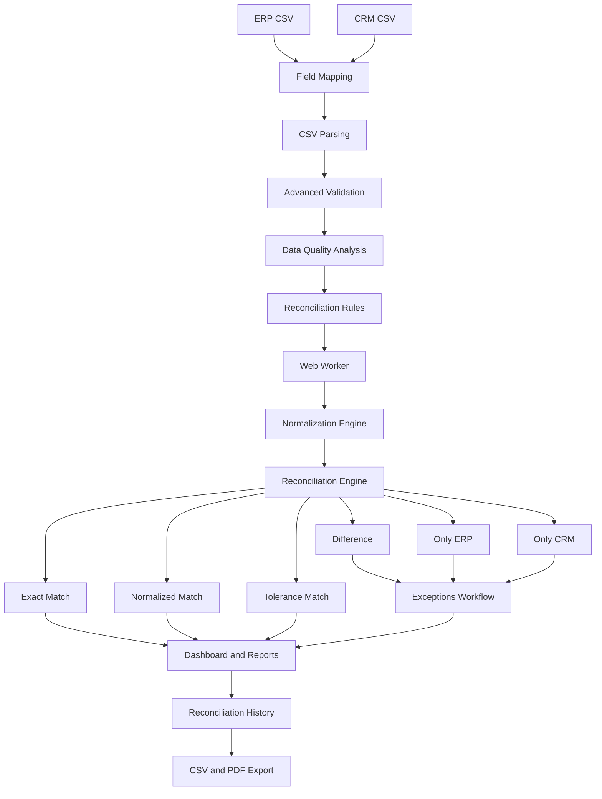

# Enterprise Data Reconciliation Platform

[](https://github.com/Osarii/enterprise-data-reconciliation/actions/workflows/ci.yml)


A modern enterprise-oriented data reconciliation platform designed to compare ERP and CRM datasets, detect inconsistencies, evaluate data quality, apply configurable reconciliation rules, manage exceptions, analyze historical performance, and generate executive reports.

The project explores a common enterprise data problem:

> **How can organizations reliably identify, explain, review, and report inconsistencies between business systems that are expected to contain equivalent information?**

---

# Overview

Organizations frequently operate multiple systems containing overlapping business information:

* ERP platforms
* CRM systems
* Billing platforms
* Financial systems
* Customer databases
* Internal operational applications

Over time, inconsistencies can appear because of:

* manual data entry
* synchronization failures
* duplicated records
* formatting inconsistencies
* missing information
* incorrect values
* schema differences
* integration failures
* business rule differences

**Enterprise Data Reconciliation Platform** provides an end-to-end frontend workflow for:

1. importing ERP and CRM datasets
2. mapping source columns
3. validating data quality
4. detecting blocking issues and warnings
5. normalizing comparable values
6. configuring reconciliation rules
7. reconciling records
8. reviewing exceptions
9. measuring processing performance
10. analyzing historical executions
11. exporting CSV and PDF reports

---

# Current Version

## V0.1.9 — Testing, Reliability & GitHub CI

The current development version includes:

* configurable field mapping
* advanced validation
* structured Data Quality Issues
* Data Quality Score V2
* duplicate detection
* suspicious ID detection
* configurable status validation
* normalization engine
* configurable reconciliation rules
* amount tolerance
* Exact Match
* Normalized Match
* Tolerance Match
* Difference detection
* ERP-only and CRM-only detection
* exception management
* executive metrics
* Recharts visualizations
* CSV exports
* PDF exports
* reconciliation history
* history analytics
* field mapping audit
* reconciliation rule audit
* processing performance metrics
* Web Worker reconciliation
* large dataset safety
* workspace persistence
* dark mode
* automated regression tests
* GitHub Actions CI

The current application is intentionally **frontend-first**.

A backend architecture using **NestJS, PostgreSQL, and Prisma** is planned for the next major development phase.

---

# CI Status

Every push to `main` and every Pull Request is validated automatically with GitHub Actions.

Current CI pipeline:

```text
GitHub Push / Pull Request
          ↓
Install Dependencies
          ↓
Vitest Regression Suite
          ↓
TypeScript Validation
          ↓
Vite Production Build
          ↓
Build & Test ✅
```

Current automated test status:

```text
Test Files: 9 passed
Tests:      43 passed
Status:     ✅ Passing
```

---

# Core Workflow



---

# Configurable Field Mapping

Enterprise systems rarely expose identical schemas.

An ERP dataset might contain:

```text
customer_id
customer_name
balance
status
```

while a CRM dataset might contain:

```text
account_code
display_name
amount_due
lifecycle_status
```

Both can be mapped to the application's canonical model:

```text
id
cliente
monto
estado
```

Example ERP mapping:

```text
customer_id     → id
customer_name   → cliente
balance         → monto
status          → estado
```

Example CRM mapping:

```text
account_code       → id
display_name       → cliente
amount_due         → monto
lifecycle_status   → estado
```

This keeps source-specific schemas separate from reconciliation logic.

---

# Canonical Data Model

The current canonical reconciliation model contains:

| Field     | Description                |
| --------- | -------------------------- |
| `id`      | Unique business identifier |
| `cliente` | Customer or entity name    |
| `monto`   | Monetary value             |
| `estado`  | Business status            |

Future versions are planned to support more advanced configurable schemas.

---

# Advanced Validation

Validation issues use a structured model instead of plain error strings.

A Data Quality Issue can include:

```ts
type
severity
message
row
field
value
relatedRows
```

This makes issues usable by:

* Imports
* Reports
* reconciliation blocking
* metrics
* history
* future backend APIs

---

# Data Quality Issue Categories

Current issue categories include:

* Missing Value
* Invalid Amount
* Negative Amount
* Duplicate ID
* Invalid Status
* Suspicious ID
* Unexpected Column
* Missing Column
* CSV Parse Error
* Empty File

---

# Severity System

Issues are classified as:

## BLOCKING

Blocking issues prevent reconciliation.

Examples:

* missing required values
* invalid amounts
* negative amounts
* duplicate IDs
* invalid statuses
* missing required columns
* CSV parsing failures
* empty datasets

## WARNING

Warnings indicate potentially suspicious information but allow reconciliation to continue.

Examples:

* suspicious identifiers
* unexpected columns

---

# Duplicate Detection

Duplicate IDs are considered blocking because the reconciliation identifier must uniquely identify a record.

The platform reports:

```text
Duplicate ID: DUP-001

Rows:
3, 4
```

This allows users to locate the exact source rows causing the problem.

---

# Suspicious ID Detection

Enterprise identifiers are not assumed to contain only numbers.

Valid examples include:

```text
CUS-10025
CR-2026-001
ACC_0054
```

The platform can warn about:

* unusually short IDs
* extremely long IDs
* leading or trailing spaces
* internal spaces
* unusual characters
* repeated separators
* separators at the beginning or end

Suspicious IDs generate warnings rather than blocking errors.

---

# Status Validation

The current default status catalog includes:

```text
Activo
Inactivo
Pendiente
```

Validation uses normalization.

Therefore:

```text
Activo
activo
ACTIVO
 Activo
```

are recognized as equivalent valid statuses.

Examples such as:

```text
Actiov
Cancelado
Desconocido
```

are reported as invalid.

The status catalog is separated from validation logic so it can become configurable later.

---

# Data Quality Score V2

The platform implements an **application-defined Data Quality Score**.

It is not presented as an international standard.

The score provides an explainable internal quality indicator based on factors such as:

* blocking issues
* warnings
* duplicate IDs
* structural problems
* affected rows

Conceptually:

```text
Score = 100
        - Blocking Impact
        - Warning Impact
        - Duplicate Impact
        - Structural Impact
```

Blocking problems have significantly greater impact than warnings.

The final score is constrained between:

```text
0 – 100
```

---

# Data Quality Metrics

Each imported dataset exposes:

* Data Quality Score
* Blocking Issues
* Warnings
* Duplicate IDs
* Invalid Values
* Total Rows
* Clean Rows
* Rows With Issues

An Issue Breakdown is also available.

Example:

```text
Duplicate ID        1
Invalid Amount      2
Suspicious ID       3
Unexpected Column   2
```

---

# Normalization Engine

Textual values can be normalized before reconciliation.

Normalization currently includes:

* trimming whitespace
* collapsing repeated spaces
* lowercase conversion
* removing diacritics

For example:

```text
Medical Solutions CR
 medical solutions cr
MEDICAL SOLUTIONS CR
```

are treated as equivalent after normalization.

Likewise:

```text
Café Central
CAFE CENTRAL
```

can produce a **Normalized Match**.

---

# Configurable Reconciliation Rules

V0.1.7 introduced configurable comparison rules.

Current configuration includes:

```text
Customer normalization
Status normalization
Amount tolerance
ID matching
```

ID matching intentionally remains exact.

---

# Amount Tolerance

Amount comparison can operate in either:

```text
Strict Mode
```

or:

```text
Absolute Tolerance
```

Example with tolerance `±5`:

```text
ERP amount: 5000
CRM amount: 5003

Difference = 3
Tolerance  = 5

→ Tolerance Match
```

But:

```text
ERP amount: 10000
CRM amount: 10020

Difference = 20
Tolerance  = 5

→ Difference
```

Tolerance Matches are successful reconciliations and do not appear as exceptions.

---

# Reconciliation Outcomes

The engine classifies records into six outcomes.

## Exact Match

Raw values match exactly.

## Normalized Match

Differences are only representational and disappear after normalization.

## Tolerance Match

A configured reconciliation rule accepts a difference.

## Difference

The record exists in both systems but contains a meaningful discrepancy.

## Only ERP

The record exists only in ERP.

## Only CRM

The record exists only in CRM.

---

# Exception Management

Exceptions include only real reconciliation problems:

* Difference
* Only ERP
* Only CRM

The following are considered successful matches and are excluded:

* Exact Match
* Normalized Match
* Tolerance Match

Exception management supports:

* search
* type filters
* Pending / Reviewed states
* individual review status
* bulk visible review
* bulk pending reset

---

# Reconciliation Metrics

Current reconciliation metrics include:

* ERP Records
* CRM Records
* Unique Records
* Matched
* Exact Matches
* Normalized Matches
* Tolerance Matches
* Differences
* Only ERP
* Only CRM
* Exceptions
* Match Rate
* Exception Rate
* Review Completion
* Reconciliation Health

---

# Reports

The Reports module provides operational and executive analytics.

Current reporting includes:

* Match Rate
* Exception Rate
* Review Completion
* Unique Records
* Exact Matches
* Normalized Matches
* Tolerance Matches
* Differences
* Only ERP
* Only CRM
* Exceptions
* ERP Data Quality
* CRM Data Quality
* Reconciliation Health
* Processing Performance

---

# Charts and Analytics

Visualizations are built with **Recharts**.

Current visualizations include:

* reconciliation distribution
* differences by field
* data quality indicators
* historical match rate
* historical data quality
* exceptions by run
* tolerance matches by run
* processing performance

---

# PDF Reporting

PDF exports use:

* jsPDF
* jsPDF-AutoTable
* html2canvas

Reports can contain:

* executive metrics
* reconciliation results
* Data Quality information
* reconciliation rules
* field mappings
* processing performance
* historical trends
* charts
* audit information
* page numbers
* report metadata

Heavy PDF libraries are loaded on demand rather than during initial application startup.

---

# CSV Export

Reconciliation information can also be exported to CSV for further analysis in:

* Excel
* Power BI
* Python
* R
* enterprise reporting tools

---

# Reconciliation History

Every successful reconciliation creates a compact historical snapshot.

History captures:

* execution date
* ERP dataset
* CRM dataset
* dataset sizes
* Data Quality scores
* Unique Records
* Matched
* Exact Matches
* Normalized Matches
* Tolerance Matches
* Differences
* Only ERP
* Only CRM
* Exceptions
* Match Rate
* processing metrics
* field mapping profile
* reconciliation rule profile

Historical entries do not duplicate every raw dataset record.

---

# History Analytics

History provides metrics such as:

* Total Runs
* Average Match Rate
* Best Match Rate
* Average Data Quality
* Average Reconciliation Time
* Average Throughput
* Largest Run

Charts include:

* Match Rate vs Data Quality
* Exceptions vs Tolerance Matches
* Processing Performance

---

# Auditability

Each historical reconciliation preserves important execution context.

## Field Mapping Audit

Example:

```text
ERP
customer_id → id
balance     → monto
```

## Reconciliation Rule Audit

Example:

```text
Customer normalization: Enabled
Status normalization: Enabled
Amount comparison: Absolute tolerance ±5
ID matching: Exact
```

This allows a historical reconciliation to explain **why records were classified as matches or differences**.

---

# Processing Performance

V0.1.8 introduced performance instrumentation.

Metrics include:

* ERP Parse Time
* CRM Parse Time
* Validation Time
* Import Processing Time
* Reconciliation Time
* Rows Processed
* Throughput
* Workload Tier

Example:

```text
Rows Processed       50,000
Reconciliation       14.1 ms
Throughput           calculated at runtime
Workload             Large
```

These are **application-observed browser metrics**, not scientific benchmark results.

---

# Workload Classification

Datasets are classified internally as:

```text
Small
Medium
Large
```

Current application-defined thresholds:

```text
Small   ≤ 5,000 rows
Medium  5,001 – 20,000 rows
Large   > 20,000 rows
```

This classification is intended for UI guidance and processing decisions.

---

# Web Worker Reconciliation

Large reconciliations are processed outside the main browser thread.

Architecture:

```text
React UI
   │
   │ postMessage
   ▼
Web Worker
   │
   ├── Normalization
   ├── Matching
   ├── Reconciliation Rules
   └── Processing Metrics
   │
   ▼
React UI
```

This prevents large reconciliation jobs from blocking the interface.

The application has been manually tested with:

```text
1,000 records
5,000 records
10,000 records
25,000 ERP + 25,000 CRM records
```

The 25k + 25k scenario was used to identify and resolve main-thread processing and browser storage limitations.

---

# Large Dataset Safety

Browser `localStorage` is intentionally not used as unlimited enterprise storage.

For smaller datasets, the application can persist the complete workspace.

For large datasets, the application uses a safer strategy:

```text
Large Dataset Mode
```

Large raw datasets remain in memory while compact information continues to be persisted:

* reconciliation history
* performance metrics
* field mappings
* reconciliation rules
* application settings

This prevents browser storage exhaustion.

---

# Persistence

Current frontend persistence uses:

```text
localStorage
```

for development-stage persistence.

Persisted information can include:

* workspace state
* history
* exception review status
* field mapping profiles
* reconciliation rules
* appearance settings
* historical metrics

This is intentionally temporary architecture.

The final enterprise version will use server-side persistence.

---

# Dark Mode

The application supports:

* Light Mode
* Dark Mode

The selected preference persists between sessions.

The interface follows a modern enterprise SaaS visual style using Material UI.

---

# Code Splitting

Application pages are loaded lazily.

Instead of loading all modules immediately:

```text
Application Start
      ↓
Core UI
      ↓
Requested Route
      ↓
Lazy-loaded Page
```

Pages include:

* Dashboard
* Imports
* Reconciliation
* Exceptions
* Reports
* History
* Settings

Heavy reporting dependencies are also deferred until required.

---

# Automated Testing

V0.1.9 introduced a regression suite using **Vitest**.

Current test status:

```text
9 test files
43 automated tests
43 passing
```

Test areas include:

## Normalization

* trimming
* lowercase conversion
* spaces
* diacritics

## Data Quality

* blocking issues
* warnings
* Data Quality Score
* suspicious IDs
* invalid statuses

## Field Mapping

* canonical mappings
* automatic suggestions
* invalid mappings
* duplicate mappings

## Reconciliation Rules

* strict comparison
* normalized comparison
* tolerance configuration
* tolerance boundaries

## Reconciliation Engine

* Exact Match
* Normalized Match
* Tolerance Match
* Difference
* Only ERP
* Only CRM
* Match Rate calculations

## Performance

* workload classification
* duration
* throughput

## History

* snapshots
* metrics
* exception totals

## Persistence

* save
* restore
* clear
* storage migration
* Large Dataset Mode

---

# Regression Scenarios

Important business behavior is protected with regression tests.

## Strict Amount Comparison

Expected result:

```text
Unique        6
Matched       2
Exact         1
Normalized    1
Tolerance     0
Differences   2
Only ERP      1
Only CRM      1
Match Rate    33.3%
```

## Amount Tolerance ±5

Expected result:

```text
Unique        6
Matched       3
Exact         1
Normalized    1
Tolerance     1
Differences   1
Only ERP      1
Only CRM      1
Match Rate    50%
```

These tests prevent future changes from silently altering reconciliation behavior.

---

# Testing Commands

Run tests in watch mode:

```bash
npm run test
```

Run the complete suite once:

```bash
npm run test:run
```

Generate coverage:

```bash
npm run test:coverage
```

Create a production build:

```bash
npm run build
```

---

# Quality Gate

Before important commits, the project can execute:

```powershell
.\scripts\run-quality-gate.ps1
```

The quality gate performs:

```text
Automated Tests
      ↓
Production Build
      ↓
PASS / FAIL
```

Recommended development workflow:

```text
npm run test:run
       ↓
npm run build
       ↓
git commit
       ↓
git push
       ↓
GitHub Actions
```

---

# GitHub Actions CI

The repository includes:

```text
.github/workflows/ci.yml
```

The workflow validates pushes and Pull Requests automatically.

Pipeline:

```text
Checkout Repository
        ↓
Setup Node.js
        ↓
npm ci
        ↓
npm run test:run
        ↓
npm run build
        ↓
✅ Success
```

Current CI status:

```text
9 / 9 test files passing
43 / 43 tests passing
TypeScript build passing
Vite production build passing
```

---

# Technology Stack

## Frontend

* React
* TypeScript
* Vite
* Material UI
* React Router

## Data Processing

* PapaParse
* Zod

## Visualization

* Recharts

## Reporting

* jsPDF
* jsPDF-AutoTable
* html2canvas

## Performance

* Web Workers
* Lazy loading
* Dynamic imports
* Processing instrumentation

## Testing

* Vitest
* jsdom
* V8 Coverage

## CI/CD

* GitHub Actions

## Persistence

* localStorage
* memory-only Large Dataset Mode

## Version Control

* Git
* GitHub

---

# Project Structure

```text
src/
├── components/
│   ├── common/
│   └── layout/
│
├── config/
│   ├── dataQualityConfig.ts
│   ├── fieldMappingConfig.ts
│   ├── performanceConfig.ts
│   ├── reconciliationRulesConfig.ts
│   └── storageConfig.ts
│
├── context/
│   ├── ReconciliationContext.tsx
│   └── ThemeModeContext.tsx
│
├── layouts/
│   └── MainLayout.tsx
│
├── pages/
│   ├── Dashboard/
│   ├── Imports/
│   ├── Reconciliation/
│   ├── Exceptions/
│   ├── Reports/
│   ├── History/
│   └── Settings/
│
├── schemas/
│
├── types/
│
├── utils/
│
├── workers/
│   └── reconciliation.worker.ts
│
├── App.tsx
├── main.tsx
├── index.css
└── theme.ts

tests/
├── normalizeData.test.ts
├── dataQuality.test.ts
├── fieldMapping.test.ts
├── reconciliationRules.test.ts
├── reconciliationSchema.test.ts
├── reconcileData.test.ts
├── performanceMetrics.test.ts
├── reconciliationHistory.test.ts
└── workspacePersistence.test.ts

scripts/
├── generate-performance-data.mjs
├── setup-testing.ps1
└── run-quality-gate.ps1

.github/
└── workflows/
    └── ci.yml

sample-data/
└── performance/
```

---

# Installation

Clone the repository:

```bash
git clone https://github.com/Osarii/enterprise-data-reconciliation.git
```

Enter the project:

```bash
cd enterprise-data-reconciliation
```

Install dependencies:

```bash
npm install
```

Run the application:

```bash
npm run dev
```

---

# Production Validation

Run automated tests:

```bash
npm run test:run
```

Create the production build:

```bash
npm run build
```

A healthy development state should have:

```text
Tests  ✅
Build  ✅
CI     ✅
```

---

# Sample Data

The project contains test datasets for multiple scenarios.

## Advanced Validation

```text
advanced-validation-good.csv
advanced-validation-warnings.csv
advanced-validation-errors.csv
```

## Persistence

```text
persistence-test-erp.csv
persistence-test-crm.csv
```

## Field Mapping

```text
field-mapping-erp.csv
field-mapping-crm.csv
```

## Reconciliation Rules

```text
reconciliation-rules-erp.csv
reconciliation-rules-crm.csv
```

## Performance

```text
performance-1k-erp.csv
performance-1k-crm.csv

performance-5k-erp.csv
performance-5k-crm.csv

performance-10k-erp.csv
performance-10k-crm.csv

performance-25k-erp.csv
performance-25k-crm.csv
```

---

# Development Roadmap

## V0.1 — Frontend Foundation

### V0.1.0 — Core Platform

* CSV imports
* basic reconciliation
* Dashboard
* Exceptions
* Reports

### V0.1.1 — Duplicate Detection + Data Quality

* duplicate ID detection
* header validation
* Data Quality improvements

### V0.1.2 — Normalization Engine

* text normalization
* Exact Match
* Normalized Match
* Difference classification

### V0.1.3 — Advanced Validation

* structured issues
* severity system
* status validation
* suspicious IDs
* Data Quality Score V2

### V0.1.4 — Persistence + Dark Mode

* frontend persistence
* appearance settings
* Dark Mode

### V0.1.5 — Reconciliation History

* historical snapshots
* persistent history

### V0.1.6 — Field Mapping + History Analytics

* configurable field mapping
* automatic mapping suggestions
* historical charts
* history PDF
* mapping audit

### V0.1.7 — Configurable Reconciliation Rules

* customer normalization rules
* status normalization rules
* amount tolerance
* Tolerance Match
* rule audit

### V0.1.8 — Performance & Scalability

* lazy loading
* code splitting
* deferred PDF dependencies
* processing metrics
* workload classification
* synthetic performance datasets

### V0.1.8.1 — Large Dataset Safety

* Web Worker reconciliation
* non-blocking processing
* Large Dataset Mode
* browser storage safety
* improved history navigation

### V0.1.9 — Testing & Reliability

* Vitest
* 43 automated tests
* 9 test suites
* regression tests
* persistence tests
* reconciliation engine tests
* GitHub Actions CI
* quality gate

---

# Next Milestone

## V0.1.10 — Frontend Release Candidate

Planned focus:

* UX polish
* accessibility
* responsive review
* loading states
* empty states
* error states
* PDF final polish
* coverage baseline
* README screenshots
* portfolio screenshots
* demo workflow
* final frontend validation

---

# V0.2 — Backend

Planned backend stack:

```text
React
   ↓
REST API
   ↓
NestJS
   ↓
Prisma ORM
   ↓
PostgreSQL
```

Potential backend entities include:

```text
User
Organization
Dataset
Import
ImportRow
DataQualityIssue
FieldMapping
ReconciliationRule
Reconciliation
ReconciliationResult
Exception
ExceptionReview
Report
AuditLog
```

---

# Future V1.0 Direction

The long-term goal is a complete enterprise reconciliation system supporting:

* authentication
* role-based access control
* organizations
* persistent datasets
* server-side reconciliation jobs
* scheduled reconciliations
* mapping profiles
* reconciliation profiles
* configurable comparison rules
* monetary tolerances
* historical analysis
* exception assignment
* review workflows
* audit logs
* advanced PDF reporting
* API integrations
* enterprise dashboards
* multi-user collaboration
* PostgreSQL persistence
* scalable background processing

---

# Current Limitations

The project is still under active development.

Current limitations include:

* frontend-only business processing
* browser persistence for small workspaces
* large datasets are memory-only
* no authentication
* no backend API
* no multi-user collaboration
* fixed canonical reconciliation fields
* no scheduled reconciliations
* no external ERP/CRM integrations yet

These limitations are intentional milestones in the development roadmap.

---

# Engineering Goals

The project emphasizes:

* strict TypeScript
* separation of concerns
* maintainable architecture
* reusable business logic
* explainable reconciliation rules
* explainable Data Quality metrics
* enterprise-oriented UX
* non-blocking processing
* measurable performance
* automated regression protection
* auditability
* CI validation
* progressive full-stack architecture

---

# Why This Project Exists

Data reconciliation is a real operational challenge.

An organization may have:

```text
ERP
CRM
Billing
Financial System
Internal Database
Data Warehouse
```

all containing information about the same customers or transactions.

Small inconsistencies can create:

* financial reporting problems
* operational errors
* incorrect customer information
* integration failures
* duplicated manual work
* compliance and audit difficulties

This project explores how a modern application can transform those inconsistencies into:

```text
Detectable
      ↓
Measurable
      ↓
Explainable
      ↓
Reviewable
      ↓
Auditable
      ↓
Reportable
```

---

# Repository

**GitHub**

https://github.com/Osarii/enterprise-data-reconciliation

---

# Project Status

```text
Current Version:    V0.1.9
Status:             Active Development
Automated Tests:    43 passing
Test Suites:        9 passing
CI:                 Passing
Architecture:       Frontend-first
Large Data:         Web Worker + Memory Safety
Next Milestone:     V0.1.10 Frontend Release Candidate
```

---

# Author

**Jared Prendas**

Computer Engineering student focused on:

* Full-Stack Development
* Enterprise Applications
* Software Engineering
* Data-oriented systems
* Practical business technology solutions

GitHub:

https://github.com/Osarii

---

# License

This project is currently developed as an educational and portfolio project.

A formal open-source license may be added in a future release.

---

## Enterprise Data Reconciliation Platform

**Turning cross-system inconsistencies into measurable, explainable, reviewable, and actionable reconciliation results.**
