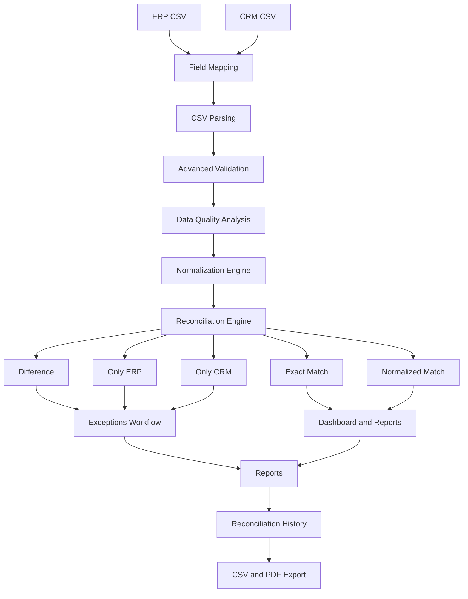

# Enterprise Data Reconciliation Platform


A modern enterprise-oriented data reconciliation platform designed to compare ERP and CRM datasets, detect inconsistencies, evaluate data quality, manage exceptions, analyze reconciliation performance, and generate executive reports.

The project focuses on solving a common enterprise problem:

> **How can organizations reliably detect discrepancies between business systems that are expected to contain equivalent information?**

---

## Overview

Enterprise systems frequently store overlapping information across platforms such as:

* ERP systems
* CRM platforms
* Financial systems
* Billing platforms
* Customer databases
* Operational systems

Over time, these systems may become inconsistent because of:

* Manual data entry
* Synchronization failures
* Duplicate records
* Inconsistent formatting
* Invalid values
* Missing records
* Integration errors
* Schema differences between systems

**Enterprise Data Reconciliation Platform** provides a workflow for importing two datasets, validating their quality, mapping source fields, normalizing comparable information, reconciling records, reviewing exceptions, analyzing historical performance, and generating reports.

---

# Current Version

## v0.1.6 — Configurable Field Mapping + History Analytics

The current development version includes:

* ERP and CRM CSV imports
* Configurable field mapping
* Automatic field mapping suggestions
* CSV parsing with PapaParse
* Schema validation with Zod
* Advanced data quality validation
* Duplicate ID detection
* Configurable status validation
* Suspicious ID detection
* Structured validation issues
* Blocking and warning severities
* Data Quality Score V2
* Normalization engine
* Exact Match detection
* Normalized Match detection
* Difference detection
* ERP-only records
* CRM-only records
* Exception management
* Executive dashboard
* Reconciliation reports
* Reconciliation history
* Historical metrics
* Historical charts
* CSV export
* PDF export
* Dark mode
* Browser persistence

The application currently operates entirely on the frontend.

A backend architecture using **NestJS, PostgreSQL, and Prisma** is planned for a future development phase.

---

# Screenshots

Screenshots will be added as the user interface continues to evolve.

Recommended screenshots for the final portfolio presentation:

* Dashboard
* Imports and Data Quality
* Reconciliation Analysis
* Exceptions Workflow
* Reports
* Reconciliation History
* Dark Mode

---

# Key Features

## CSV Import

ERP and CRM datasets can be independently imported using CSV files.

The import pipeline includes:

* CSV parsing
* Header inspection
* Configurable field mapping
* Structural validation
* Required field validation
* Duplicate detection
* Value validation
* Status validation
* Suspicious identifier detection
* Data quality analysis

---

# Configurable Field Mapping

Enterprise systems rarely use identical schemas.

An ERP system may contain:

```text
customer_id
customer_name
balance
status
```

while a CRM system may contain:

```text
account_code
display_name
amount_due
lifecycle_status
```

The platform maps both source schemas to a shared canonical model:

```text
id
cliente
monto
estado
```

Example ERP mapping:

```text
customer_id     → id
customer_name   → cliente
balance         → monto
status          → estado
```

Example CRM mapping:

```text
account_code       → id
display_name       → cliente
amount_due         → monto
lifecycle_status   → estado
```

This allows the reconciliation engine to remain independent from source-specific column names.

---

# Reconciliation Architecture



---

# Canonical Data Model

The current reconciliation model uses four canonical fields:

| Field     | Description                |
| --------- | -------------------------- |
| `id`      | Unique business identifier |
| `cliente` | Customer or entity name    |
| `monto`   | Monetary value             |
| `estado`  | Business status            |

Future versions are planned to support more advanced configurable schemas and reconciliation rules.

---

# Advanced Validation

The validation engine produces structured data quality issues.

Each issue can contain information such as:

```ts
type
severity
message
row
field
value
relatedRows
```

This allows the platform to analyze validation problems programmatically instead of relying only on plain error strings.

---

## Data Quality Issue Categories

Current categories include:

* Missing Value
* Invalid Amount
* Negative Amount
* Duplicate ID
* Invalid Status
* Suspicious ID
* Unexpected Column
* Missing Column
* CSV Parse Error
* Empty File

---

# Severity System

Validation issues are classified into two severity levels.

## BLOCKING

Blocking issues prevent reconciliation from running.

Examples:

* Duplicate IDs
* Missing required values
* Invalid amounts
* Negative amounts
* Missing required columns
* Invalid status values
* CSV parsing failures
* Empty datasets

## WARNING

Warnings indicate suspicious or potentially problematic information but do not prevent reconciliation.

Examples:

* Suspicious IDs
* Unexpected columns

This approach avoids rejecting potentially valid enterprise information unnecessarily.

---

# Duplicate Detection

Duplicate identifiers are treated as blocking issues because the reconciliation process expects each ID to uniquely identify a record.

The platform reports:

* The duplicated identifier
* The number of duplicate occurrences
* The exact rows where the duplicate appears

Example:

```text
Duplicate ID: DUP-001

Rows:
3, 4
```

---

# Suspicious ID Detection

Enterprise identifiers are not assumed to contain only numbers.

Valid identifiers may include formats such as:

```text
CUS-10025
CR-2026-001
ACC_0054
```

The validation engine can flag suspicious patterns including:

* Unusually short identifiers
* Extremely long identifiers
* Leading or trailing spaces
* Internal spaces
* Unusual characters
* Repeated separators
* Separators at the beginning or end

Suspicious identifiers generate warnings rather than blocking errors.

---

# Status Validation

Business statuses are validated against an application-defined catalog.

Current default values include:

```text
Activo
Inactivo
Pendiente
```

Status validation uses normalization.

Therefore:

```text
Activo
activo
ACTIVO
 Activo
```

are recognized as equivalent valid values.

Values such as:

```text
Actiov
Cancelado
Desconocido
```

are reported as invalid statuses.

The configuration is designed so status catalogs can become customizable in future versions.

---

# Data Quality Score V2

The platform includes an **application-defined Data Quality Score**.

It is not presented as an international standard.

The objective is to provide a simple, explainable, and defendable quality metric that can be understood by both technical and business stakeholders.

The score begins at:

```text
100
```

and applies weighted penalties based on factors such as:

* Rows containing blocking issues
* Rows containing warnings
* Duplicate identifiers
* Structural validation problems

Conceptually:

```text
Score = 100
        - Blocking Impact
        - Warning Impact
        - Duplicate Impact
        - Structural Impact
```

Blocking problems have significantly more impact than warnings.

The final score is constrained between:

```text
0 – 100
```

---

## Data Quality Metrics

Each imported dataset includes metrics such as:

* Data Quality Score
* Blocking Issues
* Warnings
* Duplicate IDs
* Invalid Values
* Total Rows
* Clean Rows
* Rows With Issues

The platform also displays an Issue Breakdown.

Example:

```text
Duplicate ID        1
Invalid Amount      2
Suspicious ID       3
Unexpected Column   2
```

---

# Normalization Engine

Before comparing textual information, selected values are normalized.

Current normalization includes:

* Trimming whitespace
* Collapsing repeated spaces
* Lowercase conversion
* Removing diacritics

For example:

```text
Medical Solutions CR
 medical solutions cr
MEDICAL SOLUTIONS CR
```

are considered equivalent after normalization.

Likewise:

```text
Café Central
CAFE CENTRAL
```

can produce a normalized match.

---

# Monetary Comparison

Monetary values currently use strict comparison.

For example:

```text
120000
120001
```

produces:

```text
Difference
```

No monetary tolerance is currently applied.

Future versions may support configurable comparison tolerances.

---

# Reconciliation Results

The reconciliation engine classifies records into five main outcomes.

## Exact Match

All relevant values match exactly.

```text
ERP = CRM
```

---

## Normalized Match

Values are not textually identical but become equivalent after normalization.

Example:

```text
ERP: Café Central
CRM: CAFE CENTRAL
```

Result:

```text
Normalized Match
```

Normalized matches are considered successful reconciliations and do **not** appear as exceptions.

---

## Difference

The record exists in both systems but contains meaningful discrepancies.

Example:

```text
ERP amount: 120000
CRM amount: 120001
```

Result:

```text
Difference
```

---

## Only ERP

The record exists in ERP but does not exist in CRM.

---

## Only CRM

The record exists in CRM but does not exist in ERP.

---

# Reconciliation Metrics

The platform generates business-oriented reconciliation metrics including:

* ERP Records
* CRM Records
* Unique Records
* Matched Records
* Exact Matches
* Normalized Matches
* Differences
* Only ERP
* Only CRM
* Exceptions
* Match Rate
* Exception Rate
* Review Completion
* Reconciliation Health

---

# Exception Management

Real reconciliation discrepancies are managed through the Exceptions workflow.

Exceptions include:

* Difference
* Only ERP
* Only CRM

Normalized Matches are intentionally excluded.

Available controls include:

* Search
* Type filtering
* Pending / Reviewed filtering
* Individual review status
* Mark visible records as reviewed
* Mark visible records as pending

Review progress is shared across the application.

---

# Dashboard

The dashboard provides an executive overview of the current reconciliation.

It displays metrics such as:

* ERP record count
* CRM record count
* Total unique records
* Match rate
* Matched records
* Differences
* ERP-only records
* CRM-only records
* Exception information
* Data quality indicators

The dashboard is designed as a modern enterprise SaaS interface.

---

# Reports

The Reports module provides reconciliation analytics for operational and executive review.

Current metrics include:

* Match Rate
* Exception Rate
* Review Completion
* Unique Records
* Matched Records
* Differences
* Only ERP
* Only CRM
* Exceptions
* Reconciliation Health
* ERP Data Quality
* CRM Data Quality

---

# Charts and Analytics

Visual analytics are built using **Recharts**.

Current visualizations include:

* Reconciliation distribution
* Differences by field
* Data quality indicators
* Match rate metrics
* Historical match rate trends
* Historical data quality trends
* Exceptions by reconciliation run

The objective is to make reconciliation results easier to understand than raw tables alone.

---

# Reconciliation History

Every successful reconciliation can create a historical snapshot.

History captures information including:

* Execution date
* ERP dataset
* CRM dataset
* ERP Data Quality
* CRM Data Quality
* Unique Records
* Matched Records
* Exact Matches
* Normalized Matches
* Differences
* Only ERP
* Only CRM
* Exceptions
* Match Rate
* ERP Field Mapping
* CRM Field Mapping

Historical entries are intentionally compact.

The application does **not** duplicate every raw ERP and CRM record for each historical execution.

---

# History Analytics

The History module provides aggregated metrics including:

* Total Runs
* Average Match Rate
* Best Match Rate
* Average Data Quality

Historical visualizations include:

* Match Rate vs Data Quality
* Exceptions by Run

This makes it possible to evaluate reconciliation performance over time.

---

# Field Mapping Audit

Historical reconciliation records preserve the source-to-canonical field mapping used during each execution.

Example:

```text
ERP

customer_id     → id
customer_name   → cliente
balance         → monto
status          → estado
```

This provides useful integration context when reviewing previous reconciliations.

---

# PDF Reporting

The application provides PDF exports using:

* jsPDF
* jsPDF-AutoTable
* html2canvas

PDF reports are designed to contain:

* Executive metrics
* Data quality metrics
* Reconciliation results
* Charts
* Exceptions
* Historical performance
* Field mapping audit information
* Report generation date
* Page numbering
* Report metadata

---

# CSV Export

Reconciliation information can also be exported as CSV for additional analysis using external tools.

---

# Dark Mode

The application includes both light and dark appearance modes.

The selected theme is persisted between sessions.

The interface follows a modern enterprise SaaS visual style using:

* Material UI
* Neutral backgrounds
* White or dark elevated surfaces
* Blue accent colors
* Responsive layouts

---

# Persistence

The current frontend uses browser storage to preserve application state.

Persisted information includes:

* ERP dataset
* CRM dataset
* Validation results
* Data Quality metrics
* Reconciliation results
* Exception review status
* Reconciliation history
* Field mapping profiles
* Appearance preference

The current development implementation uses:

```text
localStorage
```

This is intentionally a **frontend development persistence layer** and is not intended to represent the final enterprise storage architecture.

---

# Planned Backend Architecture

A future backend version will replace frontend-only persistence with:

```text
React
   ↓
REST API
   ↓
NestJS
   ↓
Prisma ORM
   ↓
PostgreSQL
```

Potential backend entities include:

```text
User
Organization
Dataset
Import
ImportRow
DataQualityIssue
FieldMapping
Reconciliation
ReconciliationResult
Exception
ExceptionReview
Report
AuditLog
```

---

# Technology Stack

## Frontend

* React
* TypeScript
* Vite
* Material UI
* React Router

## Data Processing

* PapaParse
* Zod

## Data Visualization

* Recharts

## Reporting

* jsPDF
* jsPDF-AutoTable
* html2canvas

## Icons

* Lucide React

## Persistence

* localStorage

## Version Control

* Git
* GitHub

---

# Project Structure

```text
src/
├── components/
│   └── layout/
│       ├── Header.tsx
│       └── Sidebar.tsx
│
├── config/
│   ├── dataQualityConfig.ts
│   ├── fieldMappingConfig.ts
│   └── storageConfig.ts
│
├── context/
│   ├── ReconciliationContext.tsx
│   └── ThemeModeContext.tsx
│
├── layouts/
│   └── MainLayout.tsx
│
├── pages/
│   ├── Dashboard/
│   ├── Imports/
│   ├── Reconciliation/
│   ├── Exceptions/
│   ├── Reports/
│   ├── History/
│   └── Settings/
│
├── schemas/
│   └── reconciliationSchema.ts
│
├── types/
│   ├── CsvValidation.ts
│   ├── FieldMapping.ts
│   ├── ImportedDataset.ts
│   ├── ReconciliationHistory.ts
│   ├── ReconciliationRecord.ts
│   └── ReconciliationResult.ts
│
├── utils/
│   ├── dataQuality.ts
│   ├── fieldMapping.ts
│   ├── normalizeData.ts
│   ├── parseCsv.ts
│   ├── reconcileData.ts
│   ├── reconciliationHistory.ts
│   └── workspacePersistence.ts
│
├── App.tsx
├── main.tsx
├── index.css
└── theme.ts
```

Additional test datasets are available under:

```text
sample-data/
```

---

# Installation

Clone the repository:

```bash
git clone https://github.com/Osarii/enterprise-data-reconciliation.git
```

Open the project:

```bash
cd enterprise-data-reconciliation
```

Install dependencies:

```bash
npm install
```

Start the development server:

```bash
npm run dev
```

---

# Production Build

Create a production build with:

```bash
npm run build
```

The build process runs TypeScript validation before generating the Vite production bundle.

---

# Sample Data

The repository includes dedicated datasets for testing different scenarios.

Examples include:

```text
advanced-validation-good.csv
advanced-validation-warnings.csv
advanced-validation-errors.csv

persistence-test-erp.csv
persistence-test-crm.csv

field-mapping-erp.csv
field-mapping-crm.csv
```

These datasets test:

* Clean datasets
* Warnings
* Blocking issues
* Duplicate detection
* Invalid values
* Suspicious IDs
* Field mapping
* Normalization
* Differences
* ERP-only records
* CRM-only records

---

# Example Workflow

```text
1. Import ERP CSV
        ↓
2. Configure ERP Field Mapping
        ↓
3. Validate ERP Dataset
        ↓
4. Import CRM CSV
        ↓
5. Configure CRM Field Mapping
        ↓
6. Validate CRM Dataset
        ↓
7. Review Data Quality
        ↓
8. Execute Reconciliation
        ↓
9. Analyze Matches and Differences
        ↓
10. Review Exceptions
        ↓
11. Analyze Reports
        ↓
12. Save Historical Snapshot
        ↓
13. Analyze Historical Metrics
        ↓
14. Export CSV / PDF
```

---

# Development Roadmap

## V0.1 — Frontend Foundation

### V0.1.0

* CSV imports
* Basic reconciliation
* Dashboard
* Exceptions
* Reports

### V0.1.1 — Duplicate Detection + Data Quality

* Duplicate ID detection
* Required header validation
* Data quality improvements
* Invalid row detection

### V0.1.2 — Normalization Engine

* Text normalization
* Exact Match
* Normalized Match
* Difference classification
* Normalized field analysis

### V0.1.3 — Advanced Validation

* Structured Data Quality Issues
* Severity system
* Suspicious ID detection
* Status validation
* Data Quality Score V2
* Data quality breakdown

### V0.1.4 — Persistence + Dark Mode

* Workspace persistence
* Dark mode
* Appearance persistence
* Settings page

### V0.1.5 — Reconciliation History

* Historical reconciliation snapshots
* Persistent reconciliation history
* History management

### V0.1.6 — Field Mapping + History Analytics

* Configurable field mapping
* Automatic mapping suggestions
* Field Mapping Audit
* Historical metrics
* Historical charts
* History PDF reporting
* Persistence improvements

---

# Planned Frontend Improvements

Before moving fully into the backend, potential frontend improvements include:

* Configurable reconciliation rules
* Configurable amount tolerances
* Improved field mapping profiles
* Enhanced PDF reports
* Additional analytics
* Performance optimization
* Code splitting
* Lazy-loaded pages
* Large dataset handling
* Improved accessibility
* Automated testing
* Import templates
* Improved audit information
* Better error recovery

---

# V0.2 — Backend

Planned stack:

```text
NestJS
PostgreSQL
Prisma
```

Planned capabilities include:

* Persistent server-side datasets
* Reconciliation database
* Historical storage
* Exception persistence
* Configurable business rules
* API-based reconciliation
* Improved auditability
* Larger dataset support

---

# Future V1.0 Direction

The long-term objective is to evolve the platform into a complete enterprise reconciliation system.

Potential V1.0 capabilities include:

* Authentication
* Role-based access control
* Organization workspaces
* Persistent datasets
* Reconciliation jobs
* Scheduled reconciliations
* Configurable mapping profiles
* Configurable matching rules
* Configurable monetary tolerances
* Historical comparisons
* Exception assignment
* Audit logs
* Advanced reporting
* PDF and CSV exports
* Enterprise dashboards
* Backend persistence
* Multi-user collaboration
* Scalable reconciliation processing

---

# Current Limitations

The project is currently under active development.

Current limitations include:

* Frontend-only persistence
* Browser storage limitations
* No authentication
* No backend API
* No multi-user collaboration
* Fixed canonical reconciliation fields
* Client-side reconciliation processing
* Very large datasets are not yet optimized
* Browser persistence is not intended for production enterprise usage

These limitations are expected to be addressed progressively throughout the roadmap.

---

# Engineering Goals

This project is being developed with an emphasis on:

* Maintainable architecture
* Strict TypeScript
* Clear interfaces and types
* Separation of concerns
* Reusable business logic
* Enterprise-oriented UX
* Explainable validation rules
* Explainable Data Quality metrics
* Realistic business workflows
* Historical analytics
* Data visualization
* Executive reporting
* Progressive migration toward a full-stack architecture

---

# Why This Project Exists

Data reconciliation is a real operational challenge in organizations that depend on multiple systems.

A company may have:

```text
ERP
CRM
Billing
Financial Platform
Internal Database
```

all containing information about the same customers or transactions.

Even small inconsistencies can result in:

* Incorrect financial information
* Operational errors
* Customer service problems
* Reporting inconsistencies
* Manual reconciliation work
* Integration failures

This project explores how modern web technologies can be used to create an understandable, auditable, and extensible reconciliation workflow.

---

# Repository

```text
https://github.com/Osarii/enterprise-data-reconciliation
```

---

# Project Status

```text
Current Version: v0.1.6
Status: Active Development
Architecture: Frontend-first
Persistence: Browser-based
Next Major Phase: Advanced frontend hardening and backend integration
```

---

# Author

**Jared Prendas**

Computer Engineering student focused on software development, enterprise applications, full-stack development, and practical technology solutions.

GitHub:

```text
https://github.com/Osarii
```

---

# License

This project is currently developed as an educational and portfolio project.

A formal open-source license may be added in a future version.

---

## Enterprise Data Reconciliation Platform

**Turning cross-system inconsistencies into measurable, reviewable, and actionable reconciliation results.**
